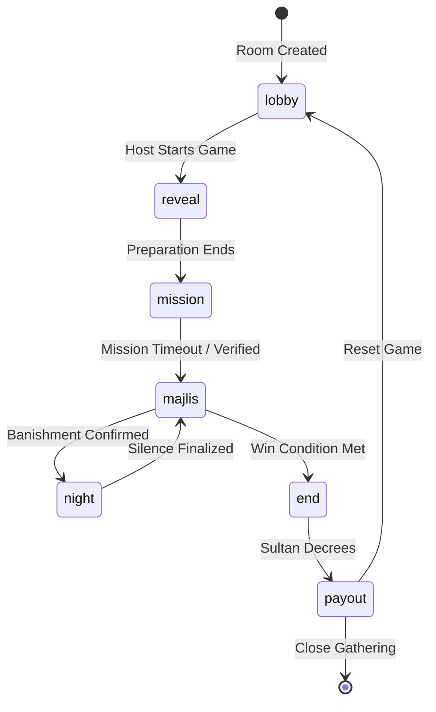
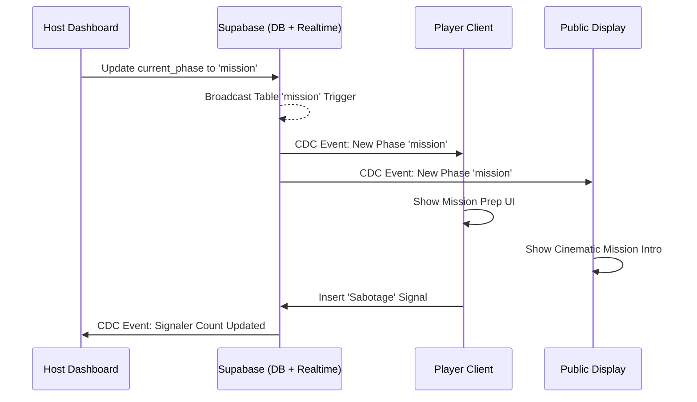

# Mehfil-e-Khaas: Game Design & Structural Parallels

## 🕯️ The Concept
"Mehfil-e-Khaas" is a social deduction game set in a high-stakes poetic gathering in historical Hyderabad. The Sultan has offered a collective bounty (`Eidi Pot`) to his most loyal poets. However, the gathering has been infiltrated by Plagiarists (`Naqal-baaz`) whose goal is to sabotage the poetry and steal the wealth for themselves.

## 🎭 Visual Identity: Royal Nocturne
The game features a premium, cinematic aesthetic defined by:
- **Palette**: Deep charcoal backgrounds with Gold (`#D4AF37`) accents.
- **Typography**: Sophisticated Serif (Lora) for headings to evoke a "Historical Manuscript" feel.
- **Atmosphere**: Glassmorphism, subtle gold glows, and smooth transitions.

## 🕹️ Gameplay Loop

### 1. Mission Phase (The Poetic Challenge)
- **Objective:** Poets must complete a logical or creative challenge set by the Sultan.
- **Mission Timing (150 seconds):**
    - **60 seconds Preparation:** All players (except Plagiarists) are blindfolded. Plagiarists use this time to view their secret assignment.
    - **90 seconds Solving:** All players open their eyes. The group works together to solve the challenge.
- **Unanimous Sabotage:** In games with multiple Plagiarists, **all active Plagiarists** must signal 'Sabotage' for it to be verified.
    - **Verification:** Once confirmed by the Host (after a unanimous signal or mission timeout), the mission is considered "Sabotaged".
    - **The Sabotage Tax:** A successful sabotaged mission adds only **₹1000** to the pot (vs ₹2000).
    - **The Plagiarist Heist:** Verified signalers receive **₹1000** in `private_gold` immediately.
    - **Immediate Feedback:** Signaling provides tactile feedback with "Signaling..." button states.

### 2. Majlis Phase (The Banishment)
- **Objective:** Debate and identify the infiltrators in the court.
- **Banishment:** Players vote on who to suspect. The Sultan then reveals the tally.
- **Hardened Tie-Breaking:** If the vote is tied, the Host utilizes:
    - **Sultan's Decree:** The Host manually selects the banished player.
    - **Re-vote:** A fresh voting round among the tied suspects.
    - **Spin the Pen:** A randomized selection with a **synchronized 8-second cinematic animation** on the Public Display.
- **Outcome:** Banished players enter the "Spirit World" (Spectator State, Zinc-themed UI).

### 3. Night Phase (The Silencing)
- **Objective:** Plagiarists choose a target to silence.
- **The Vote:** Plagiarists cast a secret ballot. The Host confirms the most-voted target.
- **Silencing:** The victim is "Zabaan-bandi" (Silenced) and is prohibited from speaking or interacting in the next Majlis.

### 4. Payout Phase (The Final Reward)
- **Objective:** Showcase the final wealth accumulated across the entire gathering.
- **The Ceremony:** The Host triggers "End Gathering & Pay Out". The display transitions to a grand leaderboard ranked by `Gathering Gold`.
- **Outcome:** Survivor statuses are revealed one last time as the Sultan distributes the final Eidi to his favorites.

## ⚙️ Game Engine & Architecture

The Mehfil-e-Khaas engine is built on a **State-Driven Sync** model, prioritizing real-time consistency and session resilience.

### 1. The Synchronized State Machine
The core of the game is a **Finite State Machine (FSM)** where the `game_rooms.current_phase` acts as the global state controller. All views (Host, Player, Display) are reactive to this single source of truth.

### 2. Data Flow Model (DFD Context)
The project utilizes a **Unidirectional Data Flow** pattern mediated by Supabase.

- **Process A: Host Controls**: The Host Dashboard sends commands to the `game-logic.ts` utility layer, which performs atomic mutations on the `game_rooms` and `players` tables.
- **Process B: Player Actions**: Player interactions (Voting, Sabotage Signaling) are captured as record inserts in the `votes`/`night_votes` tables or direct updates to the `players` table.
- **Process C: Real-time Broadcasting**: Supabase Postgres CDC (Change Data Capture) detects table mutations and broadcasts the "New/Old" payload to all subscribed clients via WebSockets.
- **Process D: State Reconciliation**: Client hooks (`useGameState`, `usePlayers`) receive the broadcast, update local React state, and trigger UI re-renders.

### 3. Database Interaction Protocols
To facilitate **Sequence Diagram** and **State Diagram** design, the following interaction patterns are standardized:

#### Phase Transitions (Host-Driven)
All phase advances clear the `mission_timer_end` and `sabotage_triggered` flags globally to prevent state leakage between rounds.
- **SQL Action**: `UPDATE game_rooms SET current_phase = 'new_phase', mission_timer_end = NULL ...`

#### The Sabotage Heist (Coordinated Sync)
This is a critical multi-step flow requiring verification:
1.  **Signal**: Plagiarists update `players.has_signaled = TRUE`.
2.  **Verify**: The Host Dashboard monitors the count. If `COUNT(signaled_plagiarists) == Total Plagiarists`, the `sabotage_triggered` flag in `game_rooms` is set to `TRUE`.
3.  **Heist**: Upon mission finalization, if `sabotage_triggered` is TRUE, the software subtracts ₹1000 from the `eidi_pot` gain and adds ₹1000 to each signaling Plagiarist's `private_gold`.

#### Liquidation Protocol (End-of-Game)
- **Calculation**: Utility fetches `eidi_pot` and counts surviving winners.
- **Distribution**: `players.private_gold += (Pot / WinnerCount)`.
- **Accumulation**: `players.gathering_gold += players.private_gold`.
- **Cleanup**: `players.private_gold = 0`, `game_rooms.eidi_pot = 0`.

## 🗂️ Project Folder Structure

A high-level overview of the repository's organization and the responsibility of each component:

- **`src/app/`**: Root of the App Router.
    - `page.tsx`: Landing page with game overview.
    - `host/`: Setup and Host Dashboard for state control.
    - `play/`: Mobile-first player interface for in-game actions.
    - `display/`: Read-only cinematic view for the audience.
    - `join/`: Entry point for players to join existing rooms.
- **`src/hooks/`**: Custom React hooks for state management.
    - `useGameState.ts`: Manages real-time sync of the `game_rooms` table.
    - `usePlayers.ts`: Manages real-time sync of the `players` table.
- **`src/lib/`**: Shared utilities and business logic.
    - `game-logic.ts`: Central engine handling transitions, roles, and wealth.
    - `supabase.ts`: Supabase client configuration.
- **`supabase/`**: Database infrastructure.
    - `schema.sql`: PostgreSQL schema (Tables, Enums, RLS Policies).
- **`public/`**: Static brand assets (icons, SVGs).

## 📊 Data Architecture (Entity Model)

The game state is managed through the following core entities in `schema.sql`:

- **`game_rooms`**: Global metadata (`current_phase`, `eidi_pot`, `room_code`, `last_game_pot`).
- **`players`**: Participant state (`role`, `status`, `private_gold`, `gathering_gold`, `has_signaled`).
- **`missions`**: Static challenge data including `secret_sabotage` instructions and `host_answer_key`.
- **`votes` / `night_votes`**: Transactional records for banishments and silencing actions.

### Wealth Engine
- **`private_gold`**: Wealth earned within a single game (Mission rewards or Sabotage heists).
- **`gathering_gold`**: Persistent wealth accumulated across multiple games in a session.
- **`eidi_pot`**: The collective pool, liquidated and distributed to winning survivors via the `liquidatePot` utility at game end.

## 🏰 Parallels with "The Traitors"

| Feature | The Traitors (UK/US) | Mehfil-e-Khaas |
| :--- | :--- | :--- |
| **Loyal Faction** | Faithfuls | Poets (`Sukhan-war`) |
| **Infiltrator Faction** | Traitors | Plagiarists (`Naqal-baaz`) |
| **Daily Activity** | Mission (Shield/Money) | Mission (`Eidi Pot` / Sabotage) |
| **Banishment Ceremony** | The Round Table | The Majlis |
| **Infiltrator Action** | The Murder | The Silencing (`Zabaan-bandi`) |
| **Eliminated Players** | Murders/Banishments | Banished (Spirit World) / Silenced |
| **The Reward** | Winning Pool | `Eidi Pot` Distribution |
| **Gathering Goal** | The Full Season | The Gathering (Up to 20 Players) |
